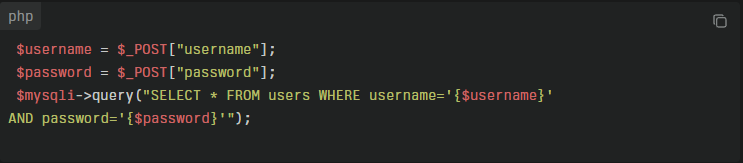

## 1. SQL Injection에 대해서
**SQL Injection(SQLi)**은 공격자가 웹 입력값을 통해 SQL 문에 악의적인 코드를 삽입함으로써 데이터베이스에서 인가되지 않은 작업을 수행하게 만드는 공격이다.
웹 애플리케이션 보안에서 가장 오래되었고, 여전히 치명적인 취약점 중 하나이다. 공격자가 웹 요청에 악의적인 SQL 구문을 삽입하여, 데이터베이스의 구조를 파악하거나, 인증을 우회하고, 심지어 데이터베이스의 제어권을 획득할 수 있게 된다. Open Web Application Security Project(OWASP)의 Top 10 보안 취약점 목록에서 항상 상위권을 차지해왔으며, 실제 침해사고에도 자주 등장한다. 본 보고서는 SQL Injection 공격의 원리, 주요 피해 사례, 그리고 대응 및 방지 방안에 대해 분석한다.

## 2. 작동 방식 및 예시
SQL 인젝션은 주로 다음과 같은 방식으로 발생합니다.

* 입력값에 SQL 구문 또는 조건식을 삽입해 쿼리의 논리를 변경
* 쿼리의 끝에 주석(--)을 추가해 뒷부분을 무시
* 여러 SQL 명령을 연달아 실행하도록 삽입
공격자가 username에 admin, password에 password' OR 1=1 --을 입력하면, 쿼리는 다음과 같이 변형됩니다:
SELECT * FROM users WHERE username='admin' and password='password' OR 1=1 --'
이 쿼리는 항상 참이 되어 인증을 우회할 수 있습니다

**공격의 주요 목적**
* 인증 우회
* 데이터 탈취 (ex. 주민번호, 카드정보 등)
* 테이블 구조 열람 (Schema 정보)
* 데이터 삭제 또는 변경
* 시스템 명령 실행 (일부 DBMS에서 가능, 예: xp_cmdshell in MSSQL)

## 3. 주요 피해
* 인증 우회(로그인 우회)
* 데이터 유출, 변조, 삭제
* 데이터베이스 구조 노출
* 전체 데이터베이스 삭제 등 심각한 피해

## 방지 방법

* Prepared Statement(준비된 구문) 사용: SQL 쿼리와 입력값을 분리해 쿼리 구조가 변하지 않도록 함. 가장 효과적인 방어책.
* 입력값 검증 및 필터링: 입력값에서 특수문자, 예약어 등을 제거하거나 이스케이프 처리.
* 최소 권한 원칙 적용: DB 계정에 최소한의 권한만 부여.
* ORM(Object-Relational Mapping) 사용: 쿼리 생성을 프레임워크에 맡겨 직접 쿼리 조합을 피함.
* 정기적인 보안 점검 및 패치: 취약점 진단 도구 활용

## 결론
SQL Injection은  입력값 검증이 미흡한 웹 애플리케이션에서 공격자가 SQL 구문을 삽입해 데이터베이스를 조작하는 공격 방식입니다. 인증 우회, 데이터 유출, 데이터 삭제 등 다양한 피해가 발생할 수 있는 단순하지만 강력한 공격입니다. 하지만 올바른 코딩 습관과 방어 기법을 사용하면 충분히 예방할 수 있습니다. 보안을 고려한 코드는 개발 초기부터 반드시 적용되어야 합니다.